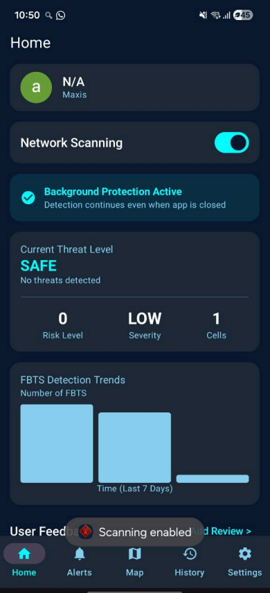
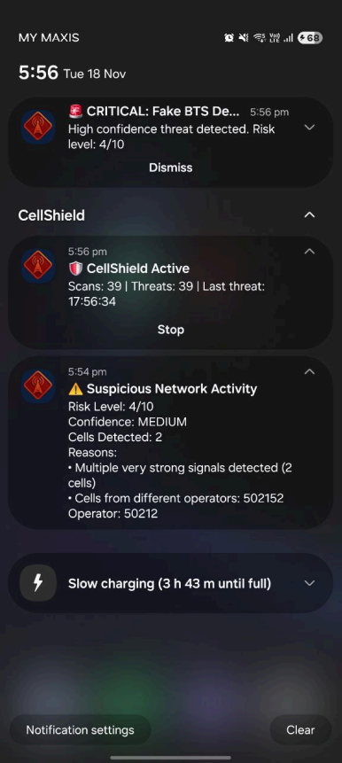
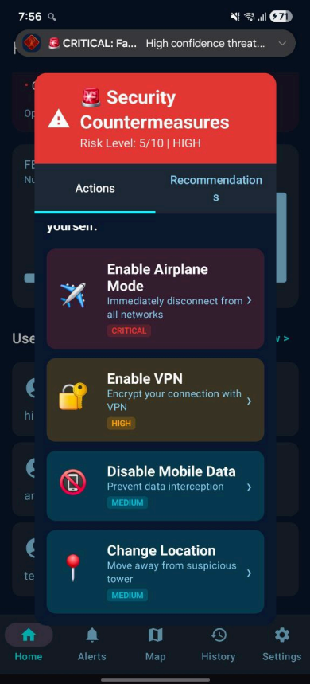

# 🛡️ CellShield: Rogue Base Station Detection & Prevention System


---

## 📌 Overview

**CellShield** is an advanced mobile security framework designed to detect **Fake Base Transceiver Stations (FBTS)** — commonly known as IMSI Catchers or Stingrays.

As mobile networks expand, vulnerabilities in 2G/3G/4G/5G protocols allow malicious actors to impersonate legitimate cell towers and intercept sensitive user data.

CellShield runs on Android devices to continuously monitor network parameters, detect anomalies in real-time, and deploy active countermeasures to protect user privacy.

This project was developed as a Final Year Project for the **German-Malaysian Institute (GMI)**.

---

## 🚀 Key Features

### 1️⃣ Real-Time Detection Engine

The app continuously scans cellular network parameters including:

- **Signal Strength Anomaly Detection**  
  Monitors for abnormally high signal strength (`> -60dBm`) often associated with nearby rogue transmitters.

- **Operator Consistency Validation**  
  Validates Mobile Country Code (MCC) and Mobile Network Code (MNC) against known legitimate operators.

- **Downgrade Attack Detection**  
  Identifies forced downgrades to less secure protocols (e.g., 4G → 2G) commonly used to bypass encryption.

---

### 2️⃣ Active Countermeasures

Upon detecting a high-confidence threat, CellShield empowers users with immediate actions:

- **Secure Routing Recommendation**  
  Suggests switching to trusted Wi-Fi or enabling VPN tunneling.

- **Network Isolation**  
  Guides users to enable Airplane Mode to immediately disconnect from the rogue tower.

---

### 3️⃣ Visualization & Forensics

- **Threat Heatmap**  
  Visualizes detected rogue BTS locations on a map interface.

- **Hybrid Logging System**
  - Cloud sync via **Firebase Firestore**
  - Local storage using **SQLite** for offline analysis

- **Push Notifications**  
  Real-time alerts using **Firebase Cloud Messaging**, even when the app runs in the background.

---

## 🧠 Threat Severity Algorithm

CellShield uses a weighted heuristic algorithm to calculate a **Threat Severity Score**, minimizing false positives by correlating multiple indicators.

### 🔎 Severity Scoring Logic

```kotlin
// Pseudocode Representation of Detection Logic
fun calculateThreatScore(signalData: SignalData): RiskLevel {

    var score = 0.0

    // Factor 1: Signal Strength Anomaly (High Weight)
    if (signalData.rsrp > -60) {
        score += 1.0
    }

    // Factor 2: Operator Mismatch (Very High Weight)
    if (signalData.operator != simCard.operator) {
        score += 2.0
    }

    // Factor 3: Protocol Downgrade (Critical Weight)
    if (signalData.networkType == 2G && previousType == 4G) {
        score += 3.0
    }

    // Factor 4: Rapid Cell Switching
    if (rapid_cell_changes_detected) {
        score += 2.0
    }

    return when {
        score >= 5.0 -> RiskLevel.CRITICAL
        score >= 3.0 -> RiskLevel.MEDIUM
        else -> RiskLevel.SAFE
    }
}
```

---

## 🛠️ Technical Architecture

### 💻 Tech Stack

- **Language:** Kotlin  
- **Backend:** Firebase  
  - Authentication  
  - Firestore  
  - Cloud Messaging  
- **Local Database:** SQLite  
- **Testing Hardware:** HackRF One (Software Defined Radio)

---

### 🧩 Architecture Modules

The codebase is structured into modular components for scalability:

- `btsdetection`  
  Core logic for analyzing signal anomalies.

- `CountermeasuresManager`  
  Handles user intervention logic (VPN, settings redirection).

- `service`  
  Manages background scanning tasks to ensure protection even when the app is closed.

---

## 📸 Screenshots

| Dashboard (Safe) | Critical Alert | Countermeasures |
|------------------|----------------|-----------------|
|  |  |  |

> Screenshots demonstrate detection of a simulated rogue attack using HackRF One.

---

## 🔮 Future Improvements

To evolve CellShield into an enterprise-grade solution:

- **Machine Learning Integration**  
  Replace heuristic thresholds with ML models trained on legitimate vs rogue datasets.

- **Multi-Platform Support**  
  Expand compatibility to iOS devices.

- **Crowd-Sourced Anomaly Database**  
  Create a shared global ledger of verified safe Cell IDs.

- **Enhanced Encryption**  
  Implement end-to-end encryption for device-to-server communication.

---

## ⚠️ Disclaimer

This application is a proof-of-concept developed for educational and research purposes.

It demonstrates vulnerabilities in cellular networks and detection methodologies.

The authors and institution are not responsible for misuse of this software.

---

## 👥 Authors

- Muhammad Ammar Bin Adi Harrizam  
- Muhammad Ashrani Bin Ariff  
- Muhammad Airil Muqrish Bin Muhammad Izuan  
- Nur Hazirah Binti Mohammad Ajlan  

**Supervisor:** Sir Muhammad Shafiq Bin Othman  
**Institution:** German-Malaysian Institute (GMI)

---

## 📄 License

This project is licensed under the MIT License — see the `LICENSE` file for details.

Intellectual property rights belong to the German-Malaysian Institute.
